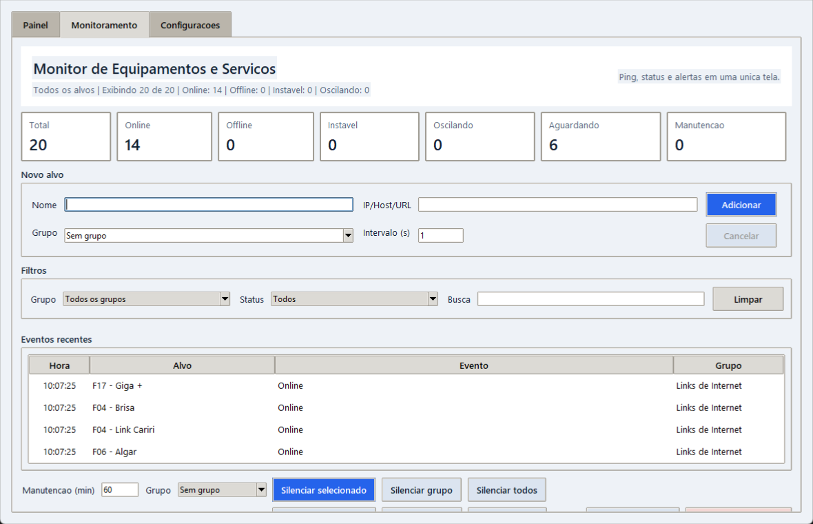
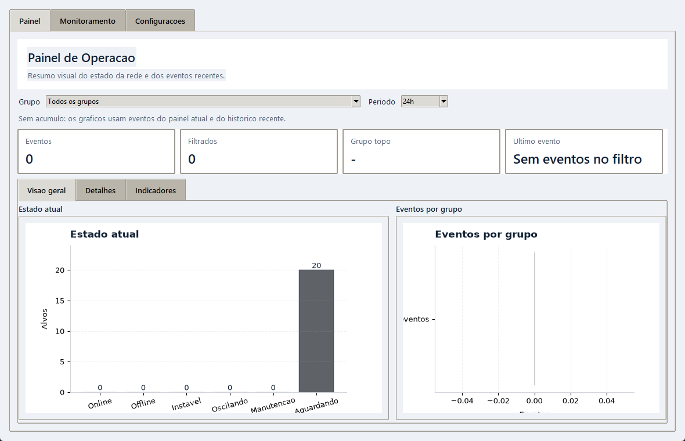

# Monitor de Equipamentos e Servicos

Aplicacao em Python com Tkinter para monitorar equipamentos de rede, hosts e
servicos web. IPs/hosts sao verificados via ping; URLs `http://` e `https://`
sao verificadas por requisicao HTTP.

## Como executar

```powershell
python main.py
```

Se o comando `python` nao estiver configurado no Windows, tente:

```powershell
py main.py
```

## Como gerar executavel

Com o PyInstaller instalado, gere o executavel com:

```powershell
py -m PyInstaller --onefile --windowed --icon="icon.ico" --name PingaNiMim main.py
```

O executavel sera gerado em:

```text
dist\PingaNiMim.exe
```

Os arquivos locais `equipamentos.txt` e `configuracoes_sensiveis.dat` serao
criados na mesma pasta do executavel. Assim, voce pode deixar o `.exe` em uma
pasta fixa e criar apenas um atalho para ele na area de trabalho.

## Funcionalidades atuais

- Cadastro de multiplos alvos por nome, endereco e grupo.
- O endereco pode ser IPv4, IPv6, nome de host ou URL completa `http://`/`https://`.
- Edicao de alvos ja cadastrados pela propria tela.
- Intervalo de monitoramento configuravel por alvo.
- Dashboard com cards de total, online, offline, instavel, oscilando, aguardando e manutencao.
- Aba `Painel` com visao geral, detalhes e indicadores operacionais.
- O painel usa apenas os 1000 eventos mais recentes para montar os graficos.
- A atualizacao do painel analitico e mais leve e roda em ritmo reduzido.
- Resumo por grupo e filtros por grupo, status e busca por nome/endereco/grupo.
- Tabela com status, latencia, horario da ultima leitura, tempo offline e ultimo evento.
- Historico rapido de eventos recentes na tela principal.
- Confirmacao de offline apenas apos falhas consecutivas configuraveis.
- Deteccao de equipamentos oscilando.
- Janela de manutencao para silenciar alertas temporariamente por alvo, grupo ou todos,
  sem envio acumulado ao encerrar.
- Notificacao via WhatsApp em intervalos de queda definidos pelo usuario.
- Intervalos, horarios e dias da semana de notificacao especificos por grupo, com regra global 24h como padrao.
- Graficos de estado atual, eventos por grupo, eventos por hora, tempo offline por grupo,
  tipos de evento e top equipamentos no historico.
- Notificacao via WhatsApp quando a conexao e reestabelecida apos uma queda alertada.
- Aba de configuracoes para informar endpoint, destinatario e chave da Evolution API.
- Fila de envio de notificacoes para processar alertas simultaneos sem disputar a API.
- Armazenamento criptografado das configuracoes sensiveis.
- Log local de inicio e fim de quedas em `quedas_log.txt`.
- Salvamento automatico dos equipamentos em `equipamentos.txt`.
- Remocao de equipamentos em monitoramento.

## Estrutura

- `main.py`: inicia a aplicacao.
- `equipment_store.py`: salva e carrega os equipamentos em arquivo texto.
- `monitor_app.py`: contem a interface grafica Tkinter.
- `ping_monitor.py`: contem a logica de ping/HTTP e as threads de monitoramento.
- `secure_settings.py`: salva e carrega configuracoes sensiveis com criptografia local.
- `notification_config.py`: contem padroes e validacao dos intervalos de notificacao.
- `notification_client.py`: cliente HTTP que envia mensagens para a Evolution API.
- `outage_notifier.py`: controla os limiares de queda e dispara os alertas.
- `outage_logger.py`: registra quedas e recuperacoes em arquivo texto.

## Alvos salvos

Ao abrir o programa, o arquivo `equipamentos.txt` e criado automaticamente caso
nao exista. Quando o programa estiver empacotado como executavel, esse arquivo
fica na mesma pasta do `.exe`. Cada alvo fica salvo em uma linha:

```text
Nome do alvo;Endereco;Grupo;IntervaloMonitoramentoSegundos
```

Exemplos:

```text
Servidor Principal;192.168.0.10;Servidores;5
Portal Cliente;https://cliente.suaempresa.com.br/health;Nuvem;30
```

Arquivos antigos nos formatos `Nome;IP` e `Nome;IP;Grupo` continuam sendo
lidos. Nesses casos, o alvo entra no grupo `Sem grupo` quando nao houver grupo
salvo e usa intervalo de monitoramento de 1 segundo quando nao houver intervalo.

Para URL web, informe o endereco completo com `http://` ou `https://`. O app
considera online respostas HTTP 2xx/3xx e tambem 401, 403 ou 429, que costumam
indicar servico protegido ou com limite, mas respondendo.

Quando um alvo e removido pela interface, ele tambem e removido desse arquivo.

Para editar um alvo, selecione a linha na tabela, clique em `Editar
selecionado`, altere nome, endereco, grupo ou intervalo e clique em `Salvar
edicao`. O monitoramento desse alvo e reiniciado com os novos dados.

## Log de quedas

O arquivo `quedas_log.txt` e criado automaticamente quando a primeira queda for
detectada. Ele registra:

- inicio da queda;
- fim da queda;
- alvo;
- endereco monitorado;
- horario da queda;
- duracao total quando a conexao volta.

O log registra tambem quedas menores que o primeiro intervalo configurado. As
notificacoes pelo WhatsApp sao enviadas quando a queda alcanca os intervalos
definidos na aba `Configuracoes`.

Quando o programa estiver empacotado como executavel, `quedas_log.txt` fica na
mesma pasta do `.exe`.

## Configuracao da notificacao

As configuracoes da Evolution API sao feitas pela propria interface do programa,
na aba `Configuracoes`.

Preencha:

- URL do endpoint da Evolution API.
- Numero ou grupo que recebera as mensagens.
- Chave da API.
- Intervalos que devem gerar alerta quando a queda continuar.
- Intervalos especificos por grupo, quando algum grupo precisar de outro ritmo.
- Horario de notificacao por grupo, quando algum grupo nao deve alertar de madrugada.
- Quantidade de falhas seguidas para confirmar offline.
- Quantidade de mudancas online/offline e janela em minutos para marcar oscilacao.

O campo de intervalos aceita valores separados por virgula, ponto e virgula ou
espaco. Use `s` para segundos, `m` para minutos e `h` para horas. Valores sem
unidade continuam sendo tratados como minutos. Exemplos:

```text
5s, 30s, 1m, 5m
```

```text
1, 5, 15
```

O motor de monitoramento usa por padrao 3 falhas seguidas para confirmar
offline e marca oscilacao quando ha 4 mudancas de estado dentro de 10 minutos.

Na secao `Alertas por grupo`, escolha um grupo, informe os intervalos e, se
necessario, preencha `Notificar de` e `Ate` no formato `HH:MM`. Tambem marque
os dias da semana em que esse grupo pode notificar. Quando esses dois campos
ficam em branco, o grupo notifica 24h.

Fora do horario configurado, o alvo continua sendo monitorado, mas nao envia
WhatsApp e a queda nao fica acumulada para disparar depois. Para voltar a usar
o intervalo global e notificacao 24h, selecione o grupo e clique em `Usar global`.

## Painel

A aba `Painel` organiza a leitura operacional em tres partes:

- `Visao geral`: estado atual e eventos por grupo.
- `Detalhes`: eventos por hora e lista filtrada de eventos recentes.
- `Indicadores`: tempo offline por grupo, tipos de evento e top equipamentos no historico.

Os filtros da aba permitem escolher grupo e periodo (`24h`, `7d`, `30d` ou `todos`).
Os cards do topo mostram o total de eventos, os eventos filtrados, o grupo com mais
ocorrencias e o ultimo evento do filtro atual.

Para manter o desempenho, os graficos analiticos usam somente o historico mais
recente e nao redesenham tudo quando o estado filtrado nao mudou de fato.

## Capturas de tela

### Monitoramento



### Painel



Ao clicar em `Salvar configuracoes`, o programa cria o arquivo local:

```text
configuracoes_sensiveis.dat
```

Esse arquivo fica no `.gitignore` e nao deve ser enviado ao GitHub.
Quando o programa estiver empacotado como executavel, esse arquivo tambem fica
na mesma pasta do `.exe`.

As informacoes sao criptografadas usando a DPAPI do Windows. Isso significa que
o arquivo criptografado so pode ser lido pelo mesmo usuario do Windows que
salvou as configuracoes.

Em uma maquina nova, ou com outro usuario do Windows, basta abrir a aba
`Configuracoes` e preencher os dados novamente.

### Onde encontrar os dados da Evolution API

- URL do endpoint: fica na documentacao da Evolution API, em envio de mensagem
  de texto. O formato costuma ser `https://SEU_SERVIDOR/message/sendText/NOME_DA_INSTANCIA`.
- Chave da API: e a `apikey` ou chave da instancia no painel da Evolution API.
- Numero ou grupo: para telefone, use DDI + DDD + numero. Para grupo, use o JID
  terminado em `@g.us`.

Uma forma mais direta de achar o JID do grupo e consultar a propria Evolution
API:

```text
GET https://SEU_SERVIDOR/group/fetchAllGroups/NOME_DA_INSTANCIA?getParticipants=false
Header: apikey: SUA_CHAVE
```

A resposta lista os grupos da instancia. Copie o campo `id` do grupo desejado,
por exemplo:

```text
120363295648424210@g.us
```
